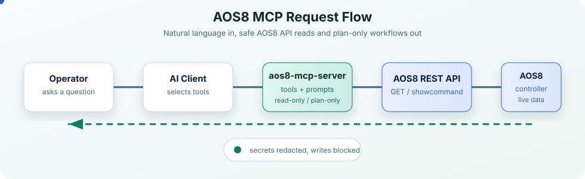

# aos8-mcp-server


Community MCP server for Aruba AOS8 Mobility Conductor and Mobility Controller environments. It helps HPE Aruba Networking customers, partners, and lab teams inspect AOS8 operational state, read configuration objects, discover native API objects, and prepare plan-only configuration payloads through the Model Context Protocol.

> Warning
>
> This is an unofficial and unsupported community project, not an HPE-supported product.
> It is not affiliated with, endorsed by, or maintained by Hewlett Packard Enterprise or HPE Aruba Networking.
> Review your organization's device, credential, and AI data-handling policies before connecting any network system to an AI assistant.
> This server is read-only by default. Plan-only configuration tools can describe proposed AOS8 API requests, but they do not send writes or save configuration.

## Overview

`aos8-mcp-server` wraps ArubaOS 8 REST APIs and exposes them as MCP tools and guided prompts. Once configured, an AI assistant can answer questions like:

- "Show all APs in my AOS8 environment."
- "Review AOS8 hardening for `/md/Example-Site`."
- "Show all WLAN and profile configuration under `/md/Example-Site`."
- "Troubleshoot why clients cannot connect to `LAB-CORP-WIFI`."
- "Plan a new SSID called `LAB-TEST-WIFI` under `/md/Example-Site`."
- "List native AOS8 configuration objects available from this controller."

## Architecture



## Operational Scope

This project intentionally separates operational visibility from configuration execution.

- Implemented: read-only show commands through the AOS8 showcommand API.
- Implemented: read-only configuration object GET for native AOS8 objects.
- Implemented: plan-only configuration payloads with redacted before/after diffs.
- Not implemented: configuration POST writes, reloads, or `write_memory`.

The current server does not expose POST writes or `write_memory`. The plan-only tool may show what a future POST request could look like, but it does not send that request.

## APIs Used

The server currently uses these AOS8 REST APIs:

```text
POST /v1/api/login
POST /v1/api/logout
GET  /v1/configuration/showcommand
GET  /v1/configuration/object
GET  /v1/configuration/container
GET  /v1/configuration/object/<object_name>
```

## Tool Categories

### Health and Inventory

| Tool | Description |
| --- | --- |
| `aos8_test_connection` | Log in and run `show version` |
| `aos8_get_version` | Return AOS8 version information |
| `aos8_get_switches` | Return controller / managed-device inventory |
| `aos8_get_managed_devices` | Return normalized controller / managed-device inventory |
| `aos8_get_access_points` | Return AP database |
| `aos8_get_ap_summary` | Return normalized AP inventory and AP health summary |
| `aos8_get_health_summary` | Return a concise health summary across controllers, APs, clients, and tunnels |
| `aos8_get_clients` | Return wireless user table |
| `aos8_get_tunnels` | Return datapath tunnel information |
| `aos8_get_license_summary` | Return license information with license keys redacted |
| `aos8_get_cluster_status` | Return cluster membership information |
| `aos8_list_command_targets` | List the default API endpoint and configured direct node targets |
| `aos8_get_node_hierarchy` | Return conductor and managed-device nodes with direct-query availability |
| `aos8_analyze_wlan_security` | Return deterministic WLAN-security findings with configuration evidence |

### Show Commands

| Tool | Description |
| --- | --- |
| `aos8_show_command` | Run an arbitrary read-only `show ...` command |

Only commands beginning with `show ` are accepted.

Most operational tools accept an optional `target_node`. A target is a named direct
API endpoint configured in `AOS8_NODE_TARGETS`; this is useful when an operational
command must run on a managed device instead of the Mobility Conductor context.

### Normalized Results

`aos8_get_managed_devices`, `aos8_get_ap_summary`, and
`aos8_get_health_summary` return a stable envelope containing `source`,
`collected_at`, `status`, `target`, `warnings`, and `data`. This gives an AI
client or a future multi-vendor aggregator consistent fields to combine with
Aruba Central or Mist results.

### Configuration Reads

| Tool | Description |
| --- | --- |
| `aos8_get_config_object` | Return a read-only configuration object by object name and config path |
| `aos8_get_ap_group_config` | Return AP group configuration |
| `aos8_get_virtual_ap_profiles` | Return Virtual AP profile configuration |
| `aos8_get_ssid_profiles` | Return SSID profile configuration |
| `aos8_get_aaa_profiles` | Return AAA profile configuration |

### Discovery

| Tool | Description |
| --- | --- |
| `aos8_list_config_objects` | Discover native AOS8 configuration object names exposed by the controller |
| `aos8_list_config_containers` | Discover native AOS8 configuration container names exposed by the controller |

Discovery results are cached in the MCP process. Pass `refresh=true` to force a new controller read.

### Plan-Only Configuration

| Tool | Description |
| --- | --- |
| `aos8_plan_config_object_change` | Build a redacted plan-only native config-object POST payload and before/after diff without writing |

This tool returns `writes_executed=false` and `save_executed=false`.

## Guided Prompts

Prompt text lives in `src/aruba_aos8_mcp/prompts.py`. Edit that file when tailoring expert workflows, then run `uv run pytest` and `uv run ruff check`.

| Prompt | Natural-language use |
| --- | --- |
| `aos8_health_overview` | "Give me an AOS8 health overview." |
| `aos8_troubleshoot_ap` | "Troubleshoot AP `AP-LAB-01`." |
| `aos8_wlan_profile_review` | "Show WLAN/profile configuration under `/md/Example-Site`." |
| `aos8_controller_failover_check` | "Check controller and AP failover readiness." |
| `aos8_ap_group_profile_map` | "Map AP groups to VAP, SSID, AAA, VLAN, and forward mode." |
| `aos8_safe_show_command` | "Run and summarize this safe show command." |
| `aos8_troubleshoot_wlan` | "Troubleshoot clients connecting to `LAB-CORP-WIFI`." |
| `aos8_review_ap_group` | "Review AP group `LAB-AP-GROUP`." |
| `aos8_security_review` | "Review WLAN security posture." |
| `aos8_hardening_review` | "Review AOS8 hardening for `/md/Example-Site`." |
| `aos8_compare_config_paths` | "Compare `/md` and `/md/Example-Site` profile configuration." |
| `aos8_config_change_plan` | "Plan a new SSID without writing config." |
| `aos8_client_connectivity_review` | "Investigate a client by MAC address." |
| `aos8_structured_troubleshooting` | "Use a structured troubleshooting workflow for a reported issue." |
| `aos8_configuration_flow_review` | "Review config flow from hierarchy path to AP group, VAP, SSID, AAA, role, VLAN, and live state." |

## Example Questions

Try these in an MCP-capable AI client:

```text
Show all AOS8 APs.
Show controller and managed-device status.
Show AOS8 version and controller uptime.
Summarize AOS8 health across controllers, APs, clients, and tunnels.
Show all managed devices and their config sync status.
Show all APs grouped by AP group and model.
Show current wireless clients.
Show AOS8 license summary.
Show cluster status.
Run show switches on AOS8.
Run show ap database on AOS8.

Show all WLAN/profile configuration under /md/Example-Site.
Map AP groups to VAP, SSID, AAA, VLAN, and forward mode under /md/Example-Site.
Show SSID profiles under /md/Example-Site.
Show AAA profiles under /md/Example-Site.
Show AP group configuration for LAB-AP-GROUP.
Compare WLAN profiles between /md and /md/Example-Site.
List native AOS8 config objects.
List native AOS8 config containers.

Review AOS8 hardening for /md/Example-Site.
Review WLAN security posture for /md/Example-Site.
Troubleshoot why clients cannot connect to LAB-CORP-WIFI.
Troubleshoot AP AP-LAB-01.
Investigate client aa:bb:cc:dd:ee:ff.
Use structured troubleshooting for guest clients cannot connect.

Plan a new SSID called LAB-TEST-WIFI under /md/Example-Site.
Plan changing the ESSID of LAB-CORP-WIFI without writing config.
Create a plan-only payload to add a VAP to LAB-AP-GROUP.
```

## Full Example Prompt Replies

These examples show concise prompt/reply output from live AOS8 systems. IP
addresses, MAC addresses, SSID names, and sensitive values are anonymized.

### Prompt

```text
Show all AOS8 APs.
```

### Reply

I found 3 active APs on the standalone AOS8 controller.

| AP | Group | Type | IP | 5 GHz Clients | 2.4 GHz Clients | 6 GHz Clients |
| --- | --- | --- | --- | ---: | ---: | ---: |
| `AP-OUTDOOR-01` | `AP-GROUP-A` | AP-635 | `<ap-ip-1>` | 4 | 2 | 0 |
| `AP-INDOOR-01` | `AP-GROUP-A` | AP-635 | `<ap-ip-2>` | 3 | 0 | 0 |
| `AP-ROOM-01` | `AP-GROUP-A` | AP-505H | `<ap-ip-3>` | 1 | 0 | - |

All active APs are in AP group `AP-GROUP-A`.

---

### Prompt

```text
Show controller and managed-device status.
```

### Reply

All controller and managed-device entries are up.

| Name | Type | IP | Model | Version | Status |
| --- | --- | --- | --- | --- | --- |
| `OfficeMM` | conductor | `<controller-ip-1>` | ArubaMM-VA | `8.10.0.20_93760` | up |
| `OfficeMM_bkup` | standby | `<controller-ip-2>` | ArubaMM-VA | `8.10.0.20_93760` | up |
| `MD1` | MD | `<managed-device-ip-1>` | Aruba7210 | `8.10.0.20_93760` | up |
| `MD2` | MD | `<managed-device-ip-2>` | Aruba7210 | `8.10.0.20_93760` | up |

---

### Prompt

```text
Show current wireless clients for <controller-ip>.
```

### Reply

I found 10 current wireless clients.

| IP | MAC | AP | SSID / Radio | Type | Role |
| --- | --- | --- | --- | --- | --- |
| `<client-ip-1>` | `<client-mac-1>` | `AP-OUTDOOR-01` | `<ssid-main> / 2.4GHz` | - | `user-role-a` |
| `<client-ip-2>` | `<client-mac-2>` | `AP-INDOOR-01` | `<ssid-main> / 5GHz-HE` | macOS | `user-role-a` |
| `<client-ip-3>` | `<client-mac-3>` | `AP-OUTDOOR-01` | `<ssid-main> / 5GHz-HE` | - | `user-role-a` |
| `<client-ip-4>` | `<client-mac-4>` | `AP-OUTDOOR-01` | `<ssid-main> / 5GHz-HE` | iPad | `user-role-a` |
| `<client-ip-5>` | `<client-mac-5>` | `AP-INDOOR-01` | `<ssid-main> / 5GHz-HE` | macOS | `user-role-a` |

AOS8 returned `User Entries: 10/10`.

---

### Prompt

```text
Investigate client <client-mac>.
```

### Reply

Client `<client-mac>` is currently connected and authenticated.

| Field | Value |
| --- | --- |
| IP | `<client-ip>` |
| Device type | macOS |
| SSID | `<ssid-main>` |
| AP | `AP-INDOOR-01` |
| BSSID | `<bssid-mac>` |
| Radio | `5GHz-HE` |
| PHY | `5GHz-HE-80-2ss` |
| VLAN | `1` |
| Role | `user-role-a` |
| AAA profile | `<aaa-profile>` |
| Forward mode | tunnel |
| Association/auth | `assoc=y`, `auth=y` |

RF/session counters looked clean in the returned data.

| Metric | Value |
| --- | ---: |
| Client SNR | 48 |
| Client retry rate | 0% |
| Client receive error rate | 0% |
| Client bandwidth rate | 1997 kbps |
| Channel | 60 |

---

### Prompt

```text
Review AOS8 hardening.
```

### Reply

I collected read-only hardening evidence from the AOS8 controller.

| Area | Status | Evidence |
| --- | --- | --- |
| Version posture | Good | AOS-8 `8.13.2.0 LSR`, build `95415` |
| Device state | Good | Controller status `up`, config `UPDATE SUCCESSFUL` |
| TLS protocol | Good | Web server allows `tlsv1.2 tlsv1.3` only |
| Telnet | Good | Telnet CLI and SOE are disabled |
| SNMP communities | Good | No SNMP communities returned |
| Admin AAA | Weak | Local admin user shown |
| Password hash | Weak | `PASSWD-HASH: sha1` |
| SSH posture | Needs review | DSA enabled; CBC ciphers and SHA1 MACs present |
| Certificates | Needs review | Web, captive portal, and IDP certs show `default` |
| WLAN security | Mixed | One WLAN uses WPA2-PSK AES; another uses WPA3-SAE AES |

No configuration changes were made.

---

### Prompt

```text
Review WLAN security posture.
```

### Reply

AP group `AP-GROUP-A` has two WLAN profiles.

| WLAN | VAP profile | SSID profile | Encryption | VLAN | Forward mode | Current clients |
| --- | --- | --- | --- | ---: | --- | ---: |
| `<ssid-main>` | `<vap-profile-main>` | `<ssid-profile-main>` | `wpa2-psk-aes` | 1 | tunnel | 10 |
| `<ssid-secure>` | `<vap-profile-secure>` | `<ssid-profile-secure>` | `wpa3-sae-aes` | 1 | tunnel | 0 |

Key observations:

| Observation | Evidence |
| --- | --- |
| Active WLAN | All 10 current clients are on `<ssid-main>` |
| Stronger WLAN exists | `<ssid-secure>` uses `wpa3-sae-aes` |
| Shared AAA | Both VAPs use the same AAA profile |
| Shared VLAN | Both VAPs use VLAN `1` |
| Client isolation | `Deny inter user traffic` is disabled on both VAPs |
| WPA2 MFP | WPA2 MFP enable/require are both disabled |
| External AAA | 802.1X server group, RADIUS accounting, and CPPM role download are not configured in the returned AAA profile |

The posture is mixed: WPA3-SAE is configured, but the active client base is still
on the WPA2-PSK SSID.

## Setup

Install `uv` if you do not already have it, then run:

```bash
uv sync
```

Create your local env file:

```bash
cp .env.example .env
```

Edit `.env` with your AOS8 controller details:

```env
AOS8_BASE_URL=https://aos8-controller.example.com:4343
AOS8_USERNAME=your-username
AOS8_PASSWORD=your-password
AOS8_VERIFY_SSL=true
# AOS8_CA_BUNDLE=/path/to/your-aos8-ca-chain.pem
AOS8_REQUEST_TIMEOUT=30
AOS8_RETRY_ATTEMPTS=3
AOS8_RETRY_BACKOFF_SECONDS=0.5
```

Do not commit `.env`.

`AOS8_VERIFY_SSL=true` verifies that the controller presents a certificate
trusted by the local machine or by `AOS8_CA_BUNDLE`. This protects the MCP
client from connecting to an impersonated controller. Set it to `false` only
for a temporary lab connection using a self-signed certificate; it is not an
appropriate production default.

### Direct Managed-Device Targets

Some AOS8 operational output is specific to a managed-device context. Configure
direct API targets as JSON, then pass the target name as `target_node` to a
tool such as `aos8_show_command` or `aos8_get_ap_summary`.

```env
AOS8_NODE_TARGETS={"SE-VMC-1":{"base_url":"https://md1.example.com:4343","config_path":"/md/SE/DC1"}}
```

Use `aos8_list_command_targets` to confirm configured names and
`aos8_get_node_hierarchy` to see which discovered devices have a direct API target.

## Run Locally

```bash
uv run aos8-mcp-server
```

For MCP inspector testing:

```bash
uv run mcp dev src/aruba_aos8_mcp/server.py
```

## MCP Client Configuration

### Codex

Add this to your Codex MCP config after replacing the placeholders:

```toml
[mcp_servers.aos8_mcp_server]
command = "uv"
args = ["run", "--directory", "/path/to/aos8-mcp-server", "aos8-mcp-server"]
startup_timeout_sec = 30

[mcp_servers.aos8_mcp_server.env]
AOS8_BASE_URL = "https://aos8-controller.example.com:4343"
AOS8_USERNAME = "your-username"
AOS8_PASSWORD = "your-password"
AOS8_VERIFY_SSL = "true"
AOS8_REQUEST_TIMEOUT = "30"
```

Restart the MCP client after editing the config.

### Claude Desktop

Add this to your Claude Desktop MCP configuration after replacing the placeholders:

```json
{
  "mcpServers": {
    "aos8-mcp-server": {
      "command": "uv",
      "args": [
        "run",
        "--directory",
        "/path/to/aos8-mcp-server",
        "aos8-mcp-server"
      ],
      "env": {
        "AOS8_BASE_URL": "https://aos8-controller.example.com:4343",
        "AOS8_USERNAME": "your-username",
        "AOS8_PASSWORD": "your-password",
        "AOS8_VERIFY_SSL": "true",
        "AOS8_REQUEST_TIMEOUT": "30"
      }
    }
  }
}
```

Restart Claude Desktop after editing the config.

### Claude Code

Claude Code can add a stdio MCP server from JSON:

```bash
claude mcp add-json aos8-mcp-server '{
  "type": "stdio",
  "command": "uv",
  "args": ["run", "--directory", "/path/to/aos8-mcp-server", "aos8-mcp-server"],
  "env": {
    "AOS8_BASE_URL": "https://aos8-controller.example.com:4343",
    "AOS8_USERNAME": "your-username",
    "AOS8_PASSWORD": "your-password",
    "AOS8_VERIFY_SSL": "true",
    "AOS8_REQUEST_TIMEOUT": "30"
  }
}'
```

### Visual Studio Code With GitHub Copilot

VS Code stores MCP server configuration in `mcp.json`, either in your workspace as `.vscode/mcp.json` or in your user profile. Add a server entry like this:

```json
{
  "servers": {
    "aos8-mcp-server": {
      "type": "stdio",
      "command": "uv",
      "args": [
        "run",
        "--directory",
        "/path/to/aos8-mcp-server",
        "aos8-mcp-server"
      ],
      "env": {
        "AOS8_BASE_URL": "https://aos8-controller.example.com:4343",
        "AOS8_USERNAME": "your-username",
        "AOS8_PASSWORD": "your-password",
        "AOS8_VERIFY_SSL": "true",
        "AOS8_REQUEST_TIMEOUT": "30"
      }
    }
  }
}
```

Save the file and reload/restart the MCP server from VS Code if prompted.

### OpenClaw

Register this local stdio server for OpenClaw-managed agent runs:

```bash
openclaw mcp add aos8-mcp-server \
  --command uv \
  --arg run \
  --arg=--directory \
  --arg /path/to/aos8-mcp-server \
  --arg aos8-mcp-server \
  --env AOS8_BASE_URL=https://aos8-controller.example.com:4343 \
  --env AOS8_USERNAME=your-username \
  --env AOS8_PASSWORD=your-password \
  --env AOS8_VERIFY_SSL=true \
  --env AOS8_REQUEST_TIMEOUT=30
```

Confirm that OpenClaw can start the server and discover its tools:

```bash
openclaw mcp status --verbose
openclaw mcp doctor aos8-mcp-server --probe
```

This configures AOS8 as a tool server for OpenClaw agents. It is different from
`openclaw mcp serve`, which exposes OpenClaw itself to another MCP client.

### Hermes Agent

Add this local stdio server under `mcp_servers` in `~/.hermes/config.yaml`:

```yaml
mcp_servers:
  aos8_mcp_server:
    command: uv
    args:
      - run
      - --directory
      - /path/to/aos8-mcp-server
      - aos8-mcp-server
    env:
      AOS8_BASE_URL: https://aos8-controller.example.com:4343
      AOS8_USERNAME: your-username
      AOS8_PASSWORD: your-password
      AOS8_VERIFY_SSL: "true"
      AOS8_REQUEST_TIMEOUT: "30"
    supports_parallel_tool_calls: false
```

Restart Hermes after saving the configuration, then ask it to run
`aos8_test_connection`. Keep parallel tool calls disabled initially to avoid
unnecessary concurrent polling against the controller; enable it later only
after confirming the controller and target systems tolerate the expected load.

For either client, keep credentials in the local client configuration, not in
this repository. For a controller using a certificate signed by an internal CA,
add `AOS8_CA_BUNDLE` with the path to the local PEM CA chain.

### Generic Stdio MCP Client

Use this command from the project directory:

```bash
uv run aos8-mcp-server
```

Pass the `AOS8_*` environment variables through your MCP client config.

## Notes

- AOS8 config object names are native API object names, not always CLI names.
- Live state is usually best collected through the showcommand API.
- Configuration intent is usually best collected through config-object GET.
- Plan-only output is for operator review and schema validation before any future write capability is considered.
- Deterministic analyzers return rule IDs, evidence, severity, and recommendations before an AI client summarizes the result. They are useful for local-LLM and no-LLM workflows.
- Transient timeouts, HTTP `429`, and HTTP `5xx` responses are retried with exponential backoff. Other API errors fail immediately.
- Package builds and tests run in GitHub Actions on Python 3.11, 3.12, and 3.13.
- This project is intended as a community starting point for lab, demo, validation, and operational-assist workflows. Use appropriate review and change-control before adapting it for production operations.

## Client Documentation

- [Claude Code MCP documentation](https://code.claude.com/docs/en/mcp)
- [VS Code MCP configuration reference](https://code.visualstudio.com/docs/copilot/reference/mcp-configuration)
